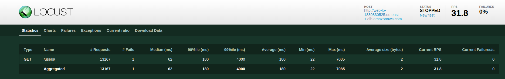

# ProjetoCloud

# VPC

Para iniciar o projeto, foi criada uma VPC na qual todos os recursos utilizados foram instanciados. Essa VPC foi configurada no bloco de CIDR `10.0.0.0/16`. Toda a infraestrutura mencionada a partir deste ponto está contida dentro dessa VPC.

## Subnets

Para possibilitar a criação de um Elastic Load Balancer, torna-se necessária a presença de duas redes públicas. Para atender a essa necessidade, foram instanciadas duas redes públicas, com blocos de CIDR equivalentes a `10.0.1.0/24` e `10.0.2.0/24`, em regiões diferentes para garantir alta disponibilidade. Essas redes foram associadas a um Internet Gateway utilizando uma tabela de roteamento, com uma associação de tabela de roteamento para cada sub-rede. As sub-redes mencionadas e a tabela de roteamento foram criadas dentro do módulo VPC; o Load Balancer foi criado dentro do módulo LB. Além disso, para atender às necessidades do RDS, foram criadas duas sub-redes privadas dentro da VPC. É importante notar que essas sub-redes não têm contato com as redes públicas, e seus blocos de CIDR são, respectivamente, `10.0.3.0/24` e `10.0.4.0/24`.

## Auto Scaling Group

Para garantir que a infraestrutura tenha poder computacional para atender picos de demanda e, ao mesmo tempo, seja financeiramente eficiente, foi criado um Auto Scaling Group com alarmes de tráfego e utilização de CPU. Esse grupo aumenta e diminui a quantidade de máquinas alocadas de forma proporcional à demanda. Esse Auto Scaling Group cria instâncias EC2 dentro das redes públicas alocadas, e as instâncias são criadas dentro do Target Group do Load Balancer. Dessa forma, toda nova instância já é capaz de receber tráfego do mesmo.

## Aplicação

A aplicação que roda dentro de todas as máquinas é um CRUD básico que está em um repositório público, clonado por todo novo EC2 no startup. Todos os comandos necessários para rodar a aplicação estão dentro do "user_data", definido no launch template.

## Banco de dados (RDS)

O banco de dados utilizado pelas aplicações é um RDS associado às duas sub-redes privadas mencionadas com multi-az (multi availability zones) para garantir alta disponibilidade - é possível usar mais de uma zona de disponibilidade por conta das redes privadas nas quais o rds reside estarem em duas zonas diferentes.

## Security Groups

Para permitir o tráfego entre os diferentes componentes da nossa infraestrutura, foram definidos Security Groups específicos para cada tipo de recurso. A configuração dos Security Groups baseia-se nas necessidades de comunicação entre esses recursos.

### Load Balancer (ALB) Security Group

O Security Group `alb-sg` é dedicado ao nosso Application Load Balancer (ALB). Ele permite o tráfego nas portas 80 e 443 para todo o tráfego IPv4 (`0.0.0.0/0`). Isso garante que o ALB possa receber solicitações HTTP e HTTPS de qualquer origem.

### EC2 Instances Security Group

O Security Group `ec2-sg` é associado às instâncias EC2. Ele permite o tráfego na porta 80 para o ALB (usando o Security Group `lb_sec_group`) e tráfego SSH (porta 22) de qualquer origem (`0.0.0.0/0`).

### RDS (Relational Database Service) Security Group

O Security Group `rds-sg` é utilizado para restringir o acesso ao banco de dados RDS, permitindo apenas tráfego na porta 3306 vindo das instâncias EC2 (usando o Security Group `ec2_sec_group`).

### Locust Security Group

O Security Group `locust-sg` é dedicado à instância que executa o Locust para testes de carga. Ele permite todo o tráfego de entrada e saída, pois o Locust precisa se comunicar com a infraestrutura durante os testes.

## Locust

Para testar toda a infraestrutura e, principalmente, se o Auto Scaling Group responde de forma adequada à demanda variada, um EC2 foi alocado em uma das subnets públicas, fora do Auto Scaling Group. Esse EC2 contém um "user_data" que inicializa o Locust, uma aplicação capaz de realizar testes de carga e fornecer dados relevantes relacionados às respostas da infraestrutura.

## Repositórios auxiliares

A aplicação utilizada no projeto está presente em https://github.com/AndreCorreaSantos/simple_python_crud.git e o locust está contido em https://github.com/AndreCorreaSantos/locust.

## Execução

Para executar a infraestrutura, é necessário possuir a AWS CLI instalada e exportar suas credenciais da AWS como variáveis de ambiente:

```bash
export AWS_ACCESS_KEY_ID=**************
export AWS_SECRET_ACCESS_KEY=************
export AWS_DEFAULT_REGION=*****************
```

Também é necessário ter um bucket S3 de nome "andrebucket" criado para guardar o backend do Terraform. Em seguida, basta rodar os seguintes comandos:

```bash
terraform init
terraform apply
```

Para utilizar a aplicação, é necessário saber o endereço do DNS. Para obtê-lo, execute o seguinte comando:

```bash
terraform state show module.lb.aws_lb.web_lb
```

O endereço relevante está na variável `dns_name` do output. Agora, podemos acessar a aplicação inserindo o seguinte URL no navegador:

```
dns_name/docs
```

Substitua `dns_name` pelo valor obtido anteriormente.

# Locust

Para rodar os testes de carga, basta inserir o IP público da instância que contém o Locust no navegador e acessar sua porta 8089.

Para encontrar o IP público, podemos executar o seguinte comando:

```bash

terraform state show module.ec2.aws_instance.locust

```

A variável `public_ip` armazena o endereço público dessa instância. Portanto, basta digitar o seguinte no navegador:

```

public_ip:8089

```

Substitua `public_ip` pelo valor obtido anteriormente. Isso permitirá acessar a interface do Locust e executar os testes de carga.

# Diagrama da infraestrutura


## Análise de custo

foram inseridas as especificações da arquitetura na calculadora de custo da aws, inclusive com valores de carga e tempo de resposta providenciados pelo locust, como tempo de resposta menor que 1 ms e 30 requests por segundo.




### Configuração de Recursos

1. **S3**

   - Armazenamento padrão
   - 1GB por mês para bloqueio de estado do Terraform.
2. **EC2**

   - 5 instâncias para lidar com uma carga constante de 30 requisições por segundo (rps).
   - 1 instância hospedando o Locust para teste de desempenho.
3. **Balanceador de Carga**

   - Balanceador de Carga de Aplicação
   - 0.144 GB processados para instâncias EC2 por mês.
   - 100 novas conexões por segundo.
   - Capacidade para 30 rps.
4. **RDS**

   - Configuração Multi-AZ
   - Disponibilidade 24/7
   - Armazenamento de 20GB.
5. **VPC**

   - IPAM (Gerenciamento de Endereços IP)
   - 6 endereços IP alocados para instâncias EC2.


[Download PDF](preço.pdf)
